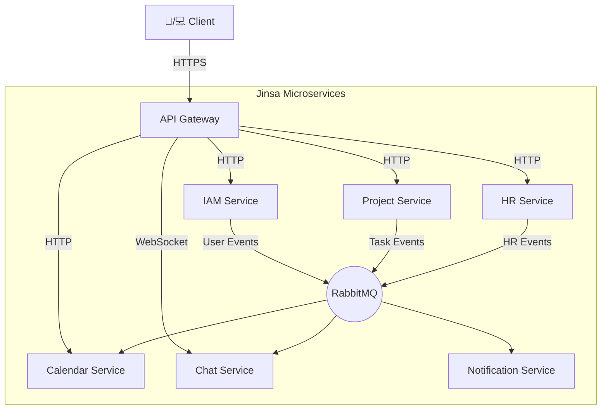

# 🚀 Jinsa - All-in-One CRM for Software Development Teams

## ✨ About

**Jinsa** is a comprehensive CRM platform designed specifically for software development companies. Streamline your project management, HR operations, and team collaboration in one powerful, intuitive solution.

### 🌟 Why Jinsa?
- **Unified Platform**: Replace multiple tools (Jira, Slack, BambooHR) with one integrated solution
- **Developer-Centric**: Built by developers, for developers
- **Scalable Architecture**: Microservices-based design grows with your team

## 🎯 Key Features

### 🗂️ Project Management
- Task tracking with customizable workflows
- Sprint planning and backlog management
- Time tracking and reporting

### 👥 Team & HR
- Centralized employee database
- Leave management (vacation, sick leave, remote work)
- Document management

### 📅 Calendar & Events
- Team and company-wide events
- Automated birthday reminders
- Meeting scheduling

### 💬 Real-time Chat
- One-on-one and group messaging
- Project-specific channels
- File sharing and search

### 🔐 Security & Access Control
- Role-based access control (RBAC)
- Multi-factor authentication
- Audit logging

## �️ Architecture

Jinsa is built on a modern microservices architecture for maximum flexibility and scalability.



## 🛠️ Tech Stack

| Component               | Technologies                                |
|-------------------------|---------------------------------------------|
| **API Gateway**        | Node.js, Express, TypeScript                |
| **Backend Services**   | NestJS, TypeScript, Prisma ORM              |
| **Real-time Chat**     | Node.js, WebSocket, Socket.IO               |
| **Databases**         | PostgreSQL, Redis, MongoDB                  |
| **Message Broker**    | RabbitMQ                                   |
| **Infrastructure**    | Docker, Kubernetes                         |
| **Frontend**          | React, Next.js, TypeScript (Planned)       |

## 🚀 Quick Start

### Prerequisites
- Docker & Docker Compose
- Node.js 18+
- Git

### Installation

1. **Clone the repository**
   ```bash
   git clone https://github.com/kotlovyim/jinsa-crm-backend.git
   cd jinsa-crm-backend
   ```

2. **Set up environment variables**
   ```bash
   # Copy example environment files
   cp api-gateway/.env.example api-gateway/.env
   cp services/*/.env.example services/*/.env
   ```
   Update the `.env` files with your configuration.

3. **Start the application**

   - Development (hot reload, mounted volumes)
     ```bash
     docker compose -f docker-compose.dev.yml up --build
     # stop: Ctrl+C, or in another terminal:
     # docker compose -f docker-compose.dev.yml down
     ```

   - Production (optimized images)
     ```bash
     docker compose up --build -d
     # view logs:
     docker compose logs -f
     # stop:
     docker compose down
     ```

4. **Access the application**
   - API Gateway: http://localhost:3000
   - IAM Service: http://localhost:3001

## 📁 Project Structure

```
/
├── api-gateway/                # API Gateway (Express + TypeScript)
├── services/                   # Microservices
│   ├── iam-service/           # Authentication & Authorization
│   ├── project-service/       # Project & Task Management
│   ├── hr-service/            # HR Operations
│   ├── calendar-service/      # Event Management
│   ├── chat-service/          # Real-time Messaging
│   └── notification-service/  # Notifications
├── docker-compose.yml         # Service orchestration
└── README.md
```

## 🤝 Contributing

We welcome contributions! Please read our [Contributing Guidelines](CONTRIBUTING.md) to get started.

1. Fork the repository
2. Create your feature branch (`git checkout -b feature/AmazingFeature`)
3. Commit your changes (`git commit -m 'Add some AmazingFeature'`)
4. Push to the branch (`git push origin feature/AmazingFeature`)
5. Open a Pull Request

## � License

Distributed under the MIT License. See `LICENSE` for more information.

Project Link: [https://github.com/kotlovyim/jinsa-crm-backend](https://github.com/kotlovyim/jinsa-crm-backend)